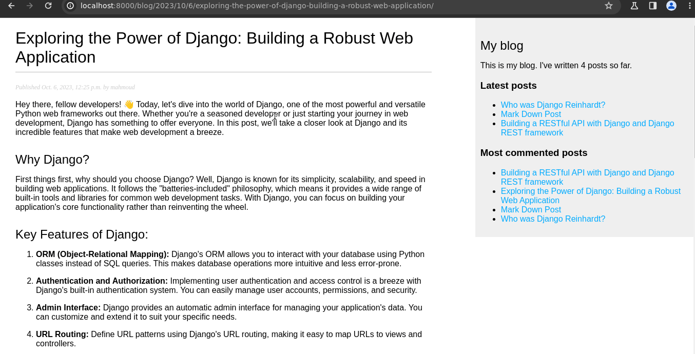
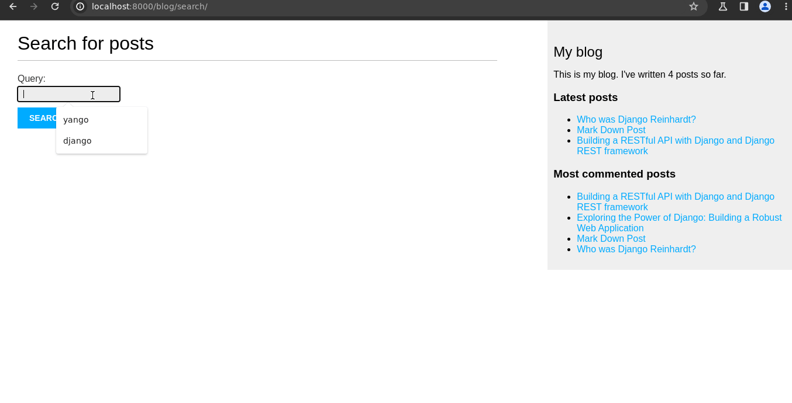

# Blog Web Application using django
The Blog App is a web application built with the Django framework, guided by [Django 4 by example book](https://www.packtpub.com/product/django-4-by-example-fourth-edition/9781801813051) to create feature-rich application using best practices.


## Main Features
- **SEO Friendly URLs:** The Blog App generates search engine-friendly URLs for better discoverability.
- **Share Posts via Email:** Easily recommend posts to others via email. Please note that this feature requires email host credentials.
- **Comment System:** Add comment to posts.
- **Tagging System:** Organize and categorize posts using tags.
- **Suggesting Similar posts :** 

- **Support for Writing Markdown Posts:** Write content in Markdown for a clean and easy-to-read format.
- **Sitemaps:** Generate sitemaps to enhance search engine optimization.
- **PostgreSQL Integration:** Utilize the power of PostgreSQL for efficient data storage and retrieval.
- **Advanced Search (TrigramSimilarity):**

- **Docker Compose:** Run and Deploy the App effortlessly with Docker Compose.

## Installtion
### Docker Setup 
1. Clone the repository: 
    ``` 
    $ git clone https://github.com/MahmoudZaytoni/blog.git
    $ cd blog
    ```
2. Run the following command to start the Docker containers: 
    ```
    $ docker-compose up
    ```
3. Apply the migrations to the database:
    ```
    $ docker compose exec web python /code/manage.py migrate
    ```
4. Load some initial data for testing purposes (optional): 
    ```
    $ docker compose exec web python /code/manage.py loaddata mysite_data.json
    ```
5. Access the app at [http://localhost:8000](http://localhost:8000)

### Simple Setup
If you do not have Docker or prefer a simplified setup, follow these steps. Please note that the PostgreSQL advanced search feature will not be available in this setup.

1. Clone the repository: 
    ``` 
    $ git clone https://github.com/MahmoudZaytoni/blog.git
    ```
2. Navigate to the project directory: 
    ```
    $ cd blog
    ```
3. Create and activate a virtual environment:
    * For Linux/Mac:
        ```
        $ python3 -m venv env
        $ source env/bin/activate
        ``` 
    * For Windows 
        ```
        $ python3 -m venv env
        $ env\Scripts\activate
        ``` 
4. Install the dependencies:
    ```
    $ pip install -r requirements.txt
    ```
5. Apply Migrations:
    ```
    $ python manage.py migrate --settings=settings.local
    ```
6. Load some data for testing purposes (optional):
    ```
    $ python manage.py loaddata mysite_data.json --settings=settings.local
    ```
7. Run the server:
    ```
    $ python manage.py runserver --settings=settings.local
    ```
8. Access the app at [http://localhost:8000](http://localhost:8000)
